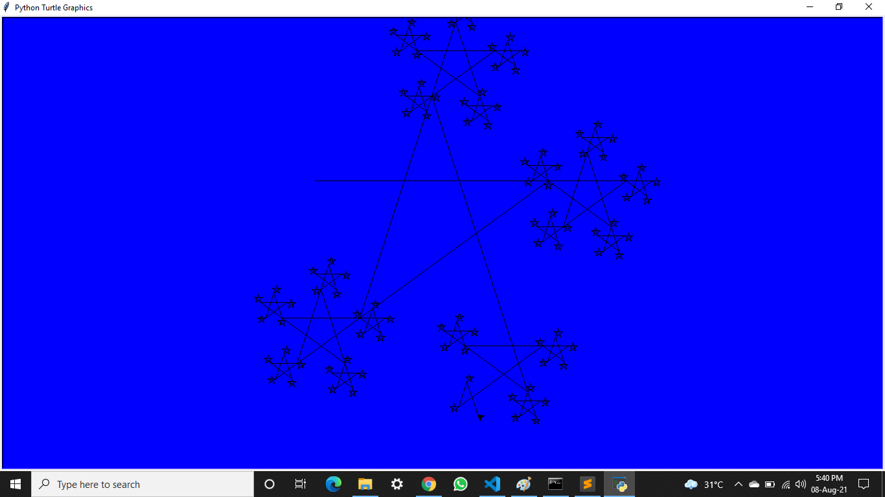

# Turtle-Library-Python
Turtle Library || Python

Here I have used turtle Library of Python to create shapes like:
**Trutle Race**  
**Clock**  
**Star**  
**Home**  

 ======== ***Turtle Race*** ===========  

Turtle Race is a very simple Assumption Game, where you can play guessing game with anyone like which Turtle is going to win the Race. you can have Fun. 

 ======== ***Clock*** ===========  

this Clock is made with the Turtle library of Python, where it shows tha Accurate **Time**, **Day**, **Date**, **Month**, and **Year**.

 ======== ***Star*** ===========  

 ======== ***Home*** ===========  

 ======== ***Thank you........*** ===========  

